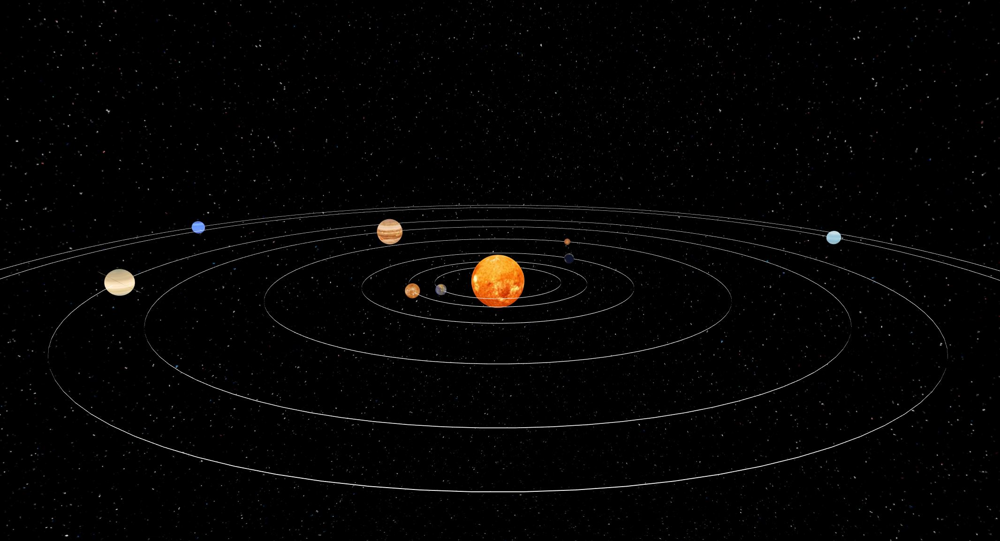

**Réalisez par Helder Salvador/Rayane Alami/Alexandre Egloff/Sami Zerrai**

---

# Projet de cours WEBGL :rocket:

Créer un Systéme solaire avec toute les planetes, avec les rotations.
En Bonus ajouter un son.

